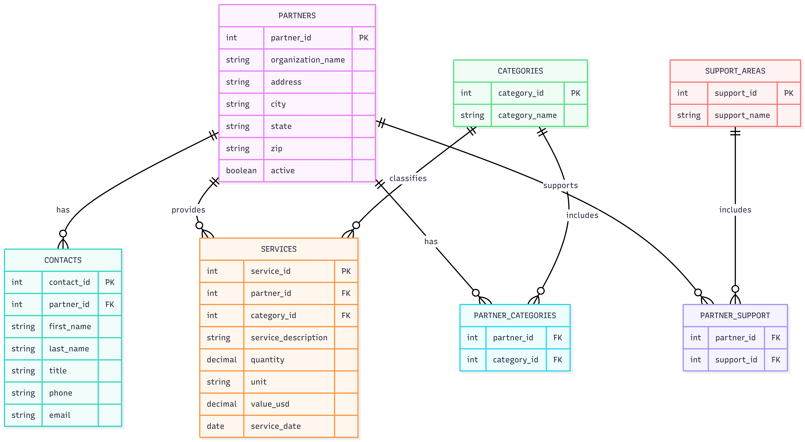

# Community Bridge Partner Impact System

Partner organization database and impact tracking system for **Community Bridge of Southwest Florida**.

This project focuses on building a structured database to manage partner organizations, track services provided, and support impact analytics and reporting.

---

## 📌 Project Overview

The goal of this system is to:

- Store partner organization information
- Manage partner contacts
- Track service categories and support areas
- Record services delivered (impact data)
- Support future analytics and dashboard reporting

⚠️ This system only manages **partner-related data** and does **not** store veteran personal data.

---

## 🗂️ Current Phase

**Phase 1 — Database Foundation**

Current work includes:

- Designing the database schema
- Creating table relationships
- Populating with dummy data
- Running validation queries

Frontend and backend development are not included at this stage.

---

## 🧱 Database Design

Below is the current database relationship diagram:



---

## 📂 Project Structure

```
community-bridge-partner-impact-system/
│
├── docs/
| ├── database/
│ | ├── Database Design Overview.pdf
│ | └── DatabaseDiagram.png
| └── community-bridge/
|   └── FGCU SYSTEM DEVELOPMENT.xlsx
│
├── database/
│ ├── DDL.sql
│ └── Data.sql
│ 
├── backend/
├── frontend/
└── README.md
```

---

## 🛠️ Tech Stack

- SQL Database (development phase)
- GitHub for version control
- Jira for project tracking

---

## 👥 Team

Team 10 — Intro to Data Engineering (COP 3710)

- Allison Brown
- Tristan Lindo-Slones
- Lujens Pierre

---

## 🚀 Future Development

Planned future phases:

- Backend/API development
- Analytics dashboard
- Reporting tools
- Integration with Group 6 veteran assessment system

